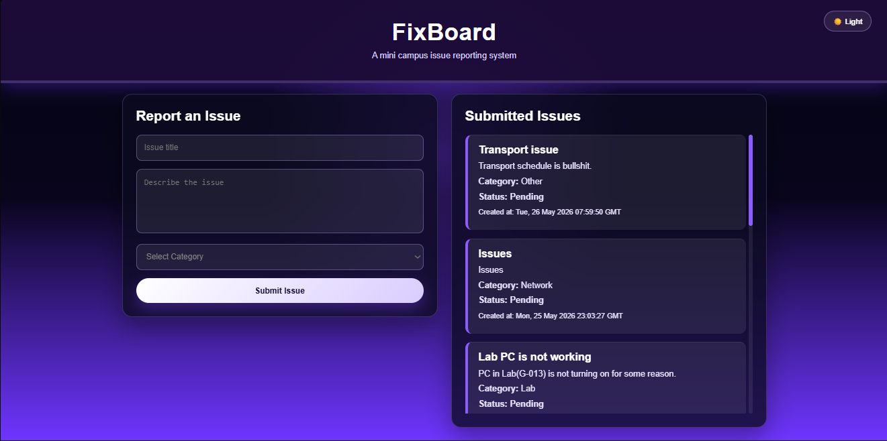
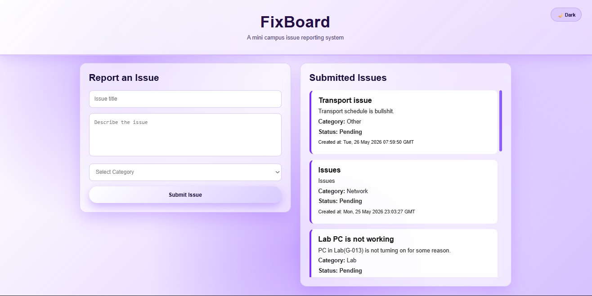

# 🛠️ FixBoard – Mini Campus Issue Reporting System

FixBoard is a small full-stack campus issue reporting web application.  
It allows students to report campus problems such as network issues, classroom problems, lab issues, lost items, and other campus-related concerns.

The project is built using **HTML, CSS, JavaScript, Python Flask, and MySQL**.  
It is deployed using **Render** for both frontend and backend, with **Aiven MySQL** as the online database.

> **🌐 Live Website:**  
> [https://pronway.diu.my.id](https://pronway.diu.my.id)

> **🔗 Backend API:**  
> [https://fixboard-lrqx.onrender.com](https://fixboard-lrqx.onrender.com)

---

## Our Team

> **Project Name:** FixBoard

- Pronway Prosoon Mitra – Developer

---

## 📸 Demo Images



---



---

## ✨ Technical Stack

- **Frontend:** HTML, CSS, JavaScript
- **Backend:** Python Flask
- **Database:** MySQL
- **Database Hosting:** Aiven MySQL
- **Backend Hosting:** Render Web Service
- **Frontend Hosting:** Render Static Site
- **Version Control:** Git + GitHub
- **Custom Domain:** pronway.diu.my.id

---

## 📚 Core Capabilities

| Feature                    | Description                                                                              |
| -------------------------- | ---------------------------------------------------------------------------------------- |
| **Issue Reporting**        | Students can submit campus-related problems through a simple form                        |
| **Issue Listing**          | All submitted issues are displayed dynamically from the database                         |
| **Category Selection**     | Issues can be categorized as Network, Classroom, Lab, Lost and Found, or Other           |
| **Status Tracking**        | Each issue has a default status such as Pending                                          |
| **MySQL Database Storage** | Submitted issues are stored permanently in an online MySQL database                      |
| **REST API**               | Flask backend provides API routes for creating and fetching issues                       |
| **Responsive Layout**      | Form and issue list are displayed side-by-side on desktop and stacked on smaller screens |
| **Light/Dark Mode**        | Users can switch between light and dark themes                                           |
| **Custom Domain**          | The deployed frontend can be accessed using a custom subdomain                           |

---

## 📂 Project Structure

```text
Fixboard/
│
├── backend/
│   ├── app.py              # Flask backend entry point
│   ├── requirements.txt    # Python dependencies
│   ├── .gitignore          # Ignores venv, .env, cache files
│   └── .env                # Local environment variables, not uploaded to GitHub
│
├── frontend/
│   ├── index.html          # Main frontend page
│   ├── style2.css          # Website styling, gradient theme, responsive layout
│   ├── script.js           # Frontend logic and API calls
│   ├── favicon.ico         # Browser favicon
│   ├── favicon.png         # PNG favicon
│   └── icon-192.png        # App icon
│
└── README.md
```

---

## ⚙️ Database Design

The project uses a MySQL database named:

```sql
fixboard_db
```

### Main Table: `issues`

```sql
CREATE TABLE issues (
    id INT AUTO_INCREMENT PRIMARY KEY,
    title VARCHAR(100) NOT NULL,
    description TEXT NOT NULL,
    category VARCHAR(50) NOT NULL,
    status VARCHAR(30) DEFAULT 'Pending',
    created_at TIMESTAMP DEFAULT CURRENT_TIMESTAMP
);
```

---

## ⚙️ Setup Instructions

### 1. Clone the Repository

```bash
git clone https://github.com/void-pronway/Fixboard.git
cd Fixboard
```

---

### 2. Backend Setup – Flask + Python

Go to the backend folder:

```bash
cd backend
```

Create a virtual environment:

```bash
python -m venv venv
```

Activate the virtual environment.

For Windows:

```bash
venv\Scripts\activate
```

For macOS/Linux:

```bash
source venv/bin/activate
```

Install required packages:

```bash
pip install -r requirements.txt
```

Create a `.env` file inside the `backend/` folder:

```env
DB_HOST=your-aiven-mysql-host
DB_PORT=your-aiven-port
DB_USER=avnadmin
DB_PASSWORD=your-aiven-password
DB_NAME=fixboard_db
```

Run the backend server locally:

```bash
python app.py
```

Backend will run at:

```text
http://127.0.0.1:5000
```

Test the API:

```text
http://127.0.0.1:5000/
http://127.0.0.1:5000/issues
```

---

### 3. Frontend Setup – HTML, CSS, JavaScript

Go to the frontend folder:

```bash
cd frontend
```

Open `index.html` using **Live Server** in VS Code.

Local frontend example:

```text
http://127.0.0.1:5500/frontend/index.html
```

Make sure `script.js` contains the correct backend API URL:

```javascript
const API_URL = "https://fixboard-lrqx.onrender.com";
```

For local backend testing, use:

```javascript
const API_URL = "http://127.0.0.1:5000";
```

---

## 🔗 API Routes

| Method | Route     | Description                       |
| ------ | --------- | --------------------------------- |
| `GET`  | `/`       | Checks whether the API is running |
| `GET`  | `/issues` | Fetches all submitted issues      |
| `POST` | `/issues` | Creates a new issue               |

### Example POST Request Body

```json
{
  "title": "Lab PC is not working",
  "description": "PC in Lab G-013 is not turning on.",
  "category": "Lab"
}
```

---

## 🚀 Deployment

### Backend Deployment – Render Web Service

The backend is deployed on **Render** as a Web Service.

| Render Setting | Value                             |
| -------------- | --------------------------------- |
| Runtime        | `Python 3`                        |
| Root Directory | `backend`                         |
| Build Command  | `pip install -r requirements.txt` |
| Start Command  | `gunicorn app:app`                |

Environment variables added in Render:

```env
DB_HOST=your-aiven-mysql-host
DB_PORT=your-aiven-port
DB_USER=avnadmin
DB_PASSWORD=your-aiven-password
DB_NAME=fixboard_db
```

Backend live URL:

```text
https://fixboard-lrqx.onrender.com
```

---

### Frontend Deployment – Render Static Site

The frontend is deployed on **Render** as a Static Site.

| Render Setting    | Value      |
| ----------------- | ---------- |
| Root Directory    | `frontend` |
| Build Command     | Empty      |
| Publish Directory | `.`        |

Frontend live URL:

```text
https://fixboard-frontend.onrender.com
```

---

## 🌐 Custom Domain Setup

The project uses the custom subdomain:

```text
pronway.diu.my.id
```

DNS record:

| Type    | Name | Content / Target                 | Proxy    |
| ------- | ---- | -------------------------------- | -------- |
| `CNAME` | `@`  | `******************************` | DNS Only |

Final website URL:

```text
https://pronway.diu.my.id
```

---

## 🧠 Project Workflow

When a student submits an issue:

```text
1. User opens the FixBoard website
2. User fills out the issue form
3. JavaScript sends a POST request to the Flask backend
4. Flask receives the data
5. Flask inserts the issue into Aiven MySQL
6. Frontend reloads the issue list
7. User sees the submitted issue on the page
```

---

## 🎨 UI Features

- Dark purple gradient theme
- Light mode and dark mode toggle
- Glassmorphism-style form and issue cards
- Responsive two-column layout
- Student user card
- Custom favicon
- Scrollable issue list

---

## 📌 Future Improvements

- Add user login system
- Add admin dashboard
- Allow admin to update issue status
- Add image upload for issue reports
- Add search and filter options
- Add issue priority levels
- Add email notification system
- Add separate student and admin roles

---

## 📄 Documentation

- **Project Report:** Add link here
- **Presentation Slides:** Add link here
- **Demo Video:** Add link here

---

## Contact

**Developer:** Pronway Prosoon Mitra

- 📧 **Email:** add-your-email-here
- 🌐 **Portfolio:** add-portfolio-link-here
- ℹ️ **LinkedIn:** add-linkedin-link-here
- 💻 **GitHub:** [https://github.com/void-pronway](https://github.com/void-pronway)

---

## FixBoard – A Simple Campus Issue Reporting System for Students

> **This README includes:**
>
> - Project introduction
> - Team information
> - Demo image placeholders
> - Technical stack
> - Features table
> - Project structure
> - Database design
> - Backend and frontend setup
> - API routes
> - Deployment instructions
> - Custom domain setup
> - Future improvements
> - Contact information
